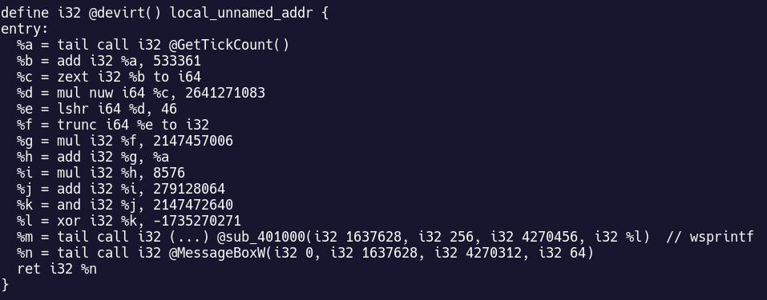
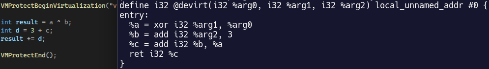
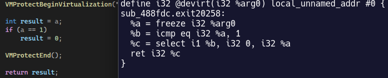

<p align="center">
   

  <h1 align="center">MogVMP</h1>
  <p align="center">Devirtualizer for 32bit binaries protected by VMProtect 3.0-3.5.</p>
</p>

MogVMP lifts code to LLVM using [Remill](https://github.com/lifting-bits/remill) to recover the original semantics behind a virtualized function. Instead of modeling the VM specific handler semantics individually (like in my previous work on [byteshield](https://eversinc33.com/2026/05/07/llvm-devirtualizer)), the whole x86 assembly code of each handler is lifted. Junk code, as well as the virtualization layer,  is subsequently optimized away by LLVMs built-in optimization passes and a custom pass that does aliasing-aware constant propagation and store forwarding over memory allocas.

For recovery of the CFG, the main goal of this project was to have it work fully statically, without needing any opcode traces or merging CFGs from traced runs. Instead, opcode handlers are lifted and optimized incrementally from VMENTER on. After each lifted handler, the next handler materializes as a constant. If it doesn't, VMP is branching: in this case, the two possible targets are extracted and the lifting process is forked. This approach works well on CFGs without jumptables, with a caveat of being rather slow. 

MogVMP runs on unpacked binaries and only attacks the virtualization of VMProtect. If a function uses multiple VMs, e.g. if it calls out to external APIs, you need to supply them to the commandline as well. The goal is not re-compilation but readable LLVM IR. In simple cases functions can be recompiled without change. In other cases, e.g. with external calls or argument buffers, manual adjustments to the IR are needed. 

That being said, **MogVMP is a PoC I created to learn Remill** - do not expect production quality, handling of edge-cases, clean code or even that it works reliably beyond the complexity of the test examples. Theres issues and work in progress. See the examples below for what can be lifted already. 

 
## Examples

A VMP 3.0.9 [DevirtualizeMe](https://forum.tuts4you.com/topic/39481-devirtualizeme-vmprotect-309/) from Tuts4You: 



Simple Math function with a static CFG:



Branching example:



## Usage

Run the binary on the target executable, witha VMENTER address and an output path:

```sh
lifter [--save-intermediate-steps] [--continue <vmentry,...>] [--args <count>] --vmenter <0xADDR> [--imagebase <0xADDR>] <pe> <out.ll>
# e.g. for a simple example
lifter --vmenter 0x004040ED ./tests/data/Project1.vmp.exe out.ll
# function with multiple VMs
lifter --vmenter 0x0040C890 --continue 0x4312d7,0x41F618 ./tests/data/devirtualizeme32_vmp_3.0.9_v1.exe devirt.ll
```

- `--vmenter <0xADDR>` - address of the VMENTER to lift
- `--args <count>` - optional, number of args the function takes. infered from the caller if not supplied
- `--imagebase <0xADDR>` - optional address to rebase the PE to
- `--continue<0xADDR>,...` - optional addresses of additional VMENTERS if the virtualized code runs on multiple VMs

### Finding VMENTERs

The PIN tool in `aux/tracer/` can be used to trace a VMProtected binary and capture virtualized function's VMENTERs.

Build the tool with the Visual Studio project in `C:\pin\source\tools\MyPinTool`, then run it via PIN against the protected binary:

```sh
pin.exe -t MyPinTool.dll -o trace.json -- target.vmp.exe [args]
```

## Build

```sh
git clone --recurse-submodules https://github.com/eversinc33/MogVMP && cd MogVMP
# If already checked out:
# git submodule update --init --recursive
cmake --preset default
cmake --build build
```

Run tests with:

```sh
ctest --test-dir build --output-on-failure
```

### Shoutouts

* [Ryan Weil](https://ryan-weil.github.io/), who happened to work on a similar project, for great discussions
* [Kyle Elliott](https://github.com/kyle-elliott-tob), for motivation, telling me VMP 3.5 was an easy target
* bakki, for giving the project its name:

<p align="center">
   
</p>


